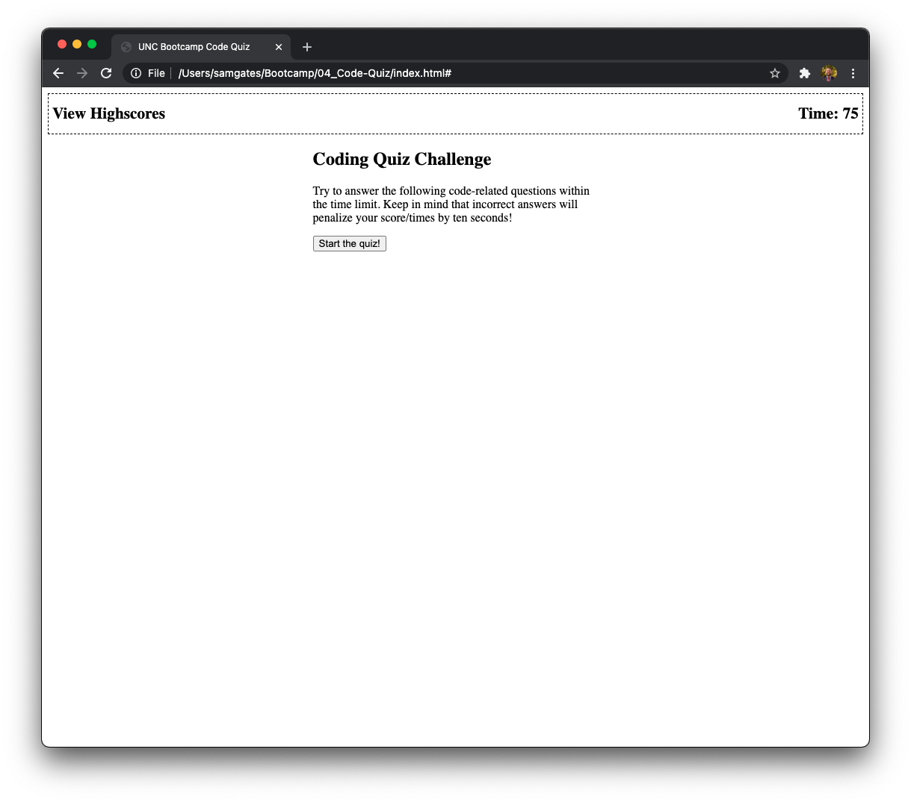
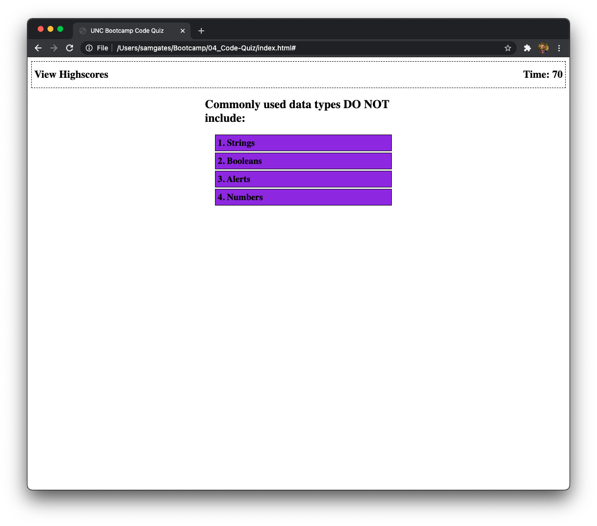

# UNC Bootcamp Code Quiz

## Description

For this homework assignment, I created a code quiz. I utilized API's to dynamically generate content as the user navigates the quiz. The user has two options on the first page: view the high scores or start the quiz. 

If the View Highscores link is clicked, the user will see a list of names and high scores from highest to lowest. If the "Start the Quiz!" button is clicked, the user begins the quiz. Each question has four answer choices. When the user chooses one answer by clicking on it, the quiz displays whether or not that was correct at the bottom. The quiz then advances to the next question. At the end of the quiz, the user is given their score and is asked to enter their initials. Once the user enters their initials, they are taken to the View Highscores page. The user can then play again, and the process begins anew. 

## Actions taken

1. Created an HTML page with DIV's and other elements to insert content into
2. Wrote a function to display the beginning content on the page
3. Wrote a function to initiate a timer that ends the game if the limit is reached, and shows time on the page
4. Wrote a function to display, check, and give the result of questions/answers
5. Wrote functions to add, remove, and display scores from local storage
6. Wrote a function to handle the end of gameplay
7. Created a GitHub reponsitory for this project, and activated GitHub pages

## Link to deployed project

See the deployed project by following this link: https://sg0703.github.io/04_Code-Quiz/
See the code repository here: https://github.com/sg0703/04_Code-Quiz

## Screenshots

